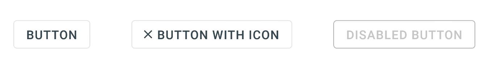
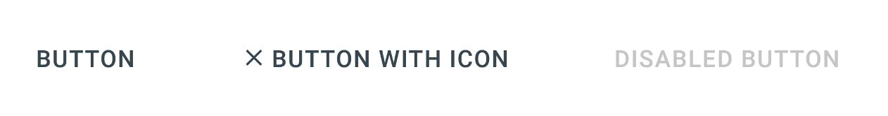

# XF.Material Library
A Xamarin.Forms library for Xamarin.Android and Xamarin.iOS to implement [Google's Material Design](https://material.io/design).

## Getting Started
1. Download the current version through [NuGet](https://www.nuget.org/packages/XF.Material) and install it in your Xamarin.Forms projects.
2. Call the `Material.Init()` method in each project:

```c#
//Xamarin.Forms

public App()
{
    InitializeComponent();
    XF.Material.Material.Init(this);
}

//Xamarin.Android

protected override void OnCreate(Bundle savedInstanceState)
{
    TabLayoutResource = Resource.Layout.Tabbar;
    ToolbarResource = Resource.Layout.Toolbar;

    base.OnCreate(savedInstanceState);

    Xamarin.Forms.Forms.Init(this, savedInstanceState);
    XF.Material.Droid.Material.Init(this, savedInstanceState);

    LoadApplication(new App());
}

//Xamarin.iOS

public override bool FinishedLaunching(UIApplication app, NSDictionary options)
{
    Xamarin.Forms.Forms.Init();
    XF.Material.iOS.Material.Init();
    LoadApplication(new App());

    return base.FinishedLaunching(app, options);
}

```

### iOS

Add this to your `info.plist` file:

```xml
<key>UIViewControllerBasedStatusBarAppearance</key>
<false/>
```

## Features

### Cards

Cards contain content and actions about a single subject.

| Code | Android  | iOS |
| ------------- | ------------- | ------------- |
| ` <material:MaterialCard CornerRadius="2" Elevation="1" HeightRequest="80" HorizontalOptions="FillAndExpand" /> ` || |

#### Properties

`MaterialCard` inherits the `Frame` class.
- `Elevation` - By default, this property has a value of 1. As you can see in the above images, as you increase the value, the more visible the shadow becomes.

#### Usage

Cards are surfaces that display content and actions on a single topic. They should be easy to scan for relevant and actionable information. Elements, like text and images, should be placed on them in a way that clearly indicates hierarchy.

Read more about cards [here](https://material.io/design/components/cards.html).

### Buttons

Buttons allow users to take actions, and make choices, with a single tap.

| Code | Android  | iOS |
| ------------- | ------------- | ------------- |
| `<material:MaterialButton BackgroundColor="#EAEAEA" HorizontalOptions="Center" Text="Elevated Button" TextColor="Black" VerticalOptions="Center" /> ` || |

#### Properties

`MaterialButton` inherits the `Button` class.

1. `ButtonType` - The type of the button. The default value is `Elevated`.

    - `Elevated` - This button will cast a shadow.
    - `Flat` - This button will have no shadow.
    - `Outlined` - This button will have no shadow, has a transparent background, and has a border.
    - `Text` - This button will only show its label. It will not have a shadow, has a transparent background, and no border. *Text buttons has a smaller inner padding as compared to the other button types.*

2. `BackgroundColor` - The color of the button's background. *Outlined and Text button types will always have a transparent background color.*

3. `Image` - The icon to be displayed next to the button's label. The color of the icon will be based on the `TextColor` property value of the button.

4. `AllCaps` - Whether the letters in the label of the button should be in upper case or not. By default, this is set to `true`.

#### Usage & Behavior
Buttons communicate actions that users can take. They are typically placed throughout your UI.

- `Elevated` and `Flat`

    
    
    These are high-emphasis buttons that are distinguished by their fill color and/or shadow. The actions bound to them are primary to your app.

- `Outlined`

    
    
    These are medium-emphasis buttons. The actions bound to them are important, but are not the primary action in an app.

- `Text`

    
    
    These buttons are typically used for less-pronounced actions, which are located in modal dialogs or in cards.

On press, buttons display touch feedback (ripple effect).

Read more about buttons [here](https://material.io/design/components/buttons.html).

### Chips
Chips are compact elements that represent an input, attribute, or action.

| Code | Android  | iOS |
| ------------- | ------------- | ------------- |
| `<material:MaterialChip BackgroundColor="#F2F2F2" Image="im_google" Text="Google" TextColor="#DE000000" /> ` || |

#### Properties

`MaterialChip` inherits the `ContentView` class.

1. `Text` - The chip's label to be displayed.

2. `TextColor` - The color of the chip's label.

3. `FontFamily` - The font family of the chip's label.

4. `BackgroundColor` - The color of the chip's background.

5. `Image` - The chip's image to be displayed.

6. `ActionImage` - The chip's action image to be displayed.

7. `ActionImageTappedCommand` - The bindable command that executes when the `ActionImage` of the chip is tapped.

8. `ActionImageTapped` - The event that is called when the `ActionImage` of the chip is tapped.

#### Usage and Behavior

Chips allow users to enter information, make selections, filter content, or trigger actions.

Read more about chips [here](https://material.io/design/components/chips.html).

### Circular Progress Indicator
An indeterminate progress indicator that express an unspecified wait time of a process.

#### Code

```xml
<material:MaterialCircularLoadingView WidthRequest="56"
    HeightRequest="56"
    Color="#6200EE" />
```

#### Properties

`MaterialCircularLoadingView` inherits the `Lottie.Forms.AnimationView`.

1. `Color` - The color of the circular progress indicator.

#### Usage & Behavior

Circular progress indicators display progress by animating an indicator along an invisible circular track in a clockwise direction. They can be applied directly to a surface, such as a button or card.

[Loading Dialog](###Loading-Dialog) uses this to indicate a process running.

Read more about circular progress indicator [here](https://material.io/design/components/progress-indicators.html#circular-progress-indicators).

### Alert Dialog
Alert dialogs interrupt users with urgent information, details, or actions.

| Code | Android  | iOS |
| ------------- | ------------- | ------------- |
| <code>MaterialDialogs.ShowAlertAsync(string message, string title = "Alert");</code><br /><br /><code>MaterialDialogs.ShowAlertAsync(string message, string title, string positiveButtonText = "Ok", Action positiveAction = null, string negativeButtonText = "CANCEL");</code> || |

#### Parameters

1. `message` - The message of the alert dialog.

2. `title` - The title of the alert dialog.

3. `positiveButtonText` - The alert dialog's confirmation button label.

4. `positiveAction` - The alert dialog's confirmation button action that will run if it was clicked.

5. `negativeButtonText` - The alert dialog's dismissive button label.

#### Usage & Behavior

An alert dialog is displayed by pushing a modal window. This will appear in front of the content of the app to provide critical information or ask for a decision. *Only one alert dialog may be displayed at a time.*

Alert dialogs are interruptive. This means that it disables all app functionality when they appear, and remain on screen until confirmed, dismissed or a required action has been taken.

Alert dialogs may be dismissed by tapping outside of the dialog, tapping the dismissive button (e.g. "Cancel" button), or by tapping the system back button (for Android).

Read more about alert dialogs [here](https://material.io/design/components/dialogs.html#alert-dialog).

<b>Handling the Back Button on Android</b>

In order for the back button to work on Android for dismissing alert dialogs, override the `OnBackPressed` method in your `MainActivity` class and add this:

```c#
public override void OnBackPressed()
{
    XF.Material.Droid.Material.HandleBackButton(base.OnBackPressed);
}
```

### Loading Dialog
A modal dialog that is displayed to inform users about a process that is running for an unspecified time.

| Code | Android  | iOS |
| ------------- | ------------- | ------------- |
| <code>using (await MaterialDialog.LoadingDialog(string message))</code><br /><code>{</code><br /><code>&nbsp;&nbsp;// Perform tasks here</code><br /><code>}</code> || |

#### Parameter

1. `message` - The message of the loading dialog.

#### Usage & Behavior

`MaterialLoadingDialog`, which is the view that appears when `MaterialDialogs.ShowLoading()` is called, inherits the `IDisposable` interface. You can only use this in a `using` block so that it automatically disappears once the task/s completes.

A loading dialog can never be dismissed, even by using Android's back button.

### Snackbar
Snackbars provide brief messages about app processes at the bottom of the screen.

| Code | Android  | iOS |
| ------------- | ------------- | ------------- |
| <code>MaterialDialogs.ShowSnackbarAsync(string message, int msDuration = 3000);</code><br /><br /><code>MaterialDialogs.ShowSnackbarAsync(string message, string actionButtonText, Action primaryAction = null, Action hideAction = null, int msDuration = 3000);</code> || |

#### Parameters

1. `message` - The message of the snackbar.

2. `duration` - The duration (milliseconds) of how long the snackbar will be displayed. To set to indefinite duration, set the value to `MaterialSnackbar.DURATION_INDEFINITE`.

3. `actionButtonText` - The snackbar's action button label.

4. `primaryAction` - The snackbar's button action that will run if it was clicked.

5. `hideAction` - The action that will run if the snackbar is removed from the screen.

#### Usage & Behavior

Snackbars can be used to inform users of a process that an app has performed, will perform, or is performing. They can appear temporarily towards the bottom of the screen. Only one snackbar may be displayed at a time.

A snackbar can contain a single action. When setting the duration of how long before it disappears automatically, the action shouldn't be "Dismiss" or "Cancel".

A snackbar can also serve as process indicator (e.g. notify users of something that is running). `MaterialSnackbar`, which is the view that appears, implements the `IDisposable` interface:

```c#
using(await MaterialDialogs.ShowLoadingSnackbar("Something is running."))
{
    // Perform tasks here.
}
```

Read more about snackbars [here](https://material.io/design/components/snackbars.html).

### Material Resources
You can create Material-based resources which will be used by your app. This library strictly follows Google's Material Design, following principles of good design while maintaining a common UI across platforms.

The `MaterialConfiguration` class allow you to define your theme and combine it along with the built in resource dictionary to your app.

#### Color

As stated [here](https://material.io/design/color/the-color-system.html#color-theme-creation), you can fully express your branding with the use of the baseline Material color theme.

Use the [Color Tool](https://material.io/tools/color/) to create your palette. This tool provides a preview of what your UI will look like while keeping accessibility.


You can define your color theme with the `MaterialColorConfiguration` class. The properties of the class are:

1. `Primary` - Displayed most frequently across your app. `MaterialNavigationPage` uses this color as its default `BarBackgroundColor`.

2. `PrimaryVariant` - A tonal variation of the `Primary` color. Used for coloring the status bar.

3. `Secondary` - Accents select parts of your UI. If not defined, it will use the `Primary` color. `MaterialButton` and `MaterialCircularLoadingView` uses this color value as their default accent color.

4. `SecondaryVariant` - A tonal variation of the `Secondary` color.

5. `Background` - The underlying color of an app's content. The root page and pages pushed by the `MaterialNavigationPage` control will have their `BackgroundColor` property set to this value by default, unless there is already a value defined in the page.

6. `Error` - The color used to indicate error status.

7. `Surface` - The color of surfaces such as cards. `MaterialCard` uses this color value as its `BackgroundColor`.

8. `OnPrimary` - A color that passes accessibility guidelines for text/iconography when drawn on top of the `Primary` color. `MaterialNavigationPage` uses this color as its `BarTextColor` by default.

9. `OnSecondary` - A color that passes accessibility guidelines for text/iconography when drawn on top of the `Secondary` color. `MaterialButton` types `Elevated` and `Flat` use this color value as their default `TextColor`.

10. `OnBackground` - A color that passes accessibility guidelines for text/iconography when drawn on top of the `Background` color.

11. `OnError` - A color that passes accessibility guidelines for text/iconography when drawn on top of the `Error` color.

12. `OnSurface` - A color that passes accessibility guidelines for text/iconography when drawn on top of the `Surface` color.

If you did not set the `ColorConfiguration` property of the `MaterialConfiguration` class in [here](#adding-the-material-resources), it will use a default color theme whose color values are the same as the image above.

#### Typography
As stated [here](https://material.io/design/typography), you can use typography to present your design and content as clearly and efficiently as possible.

##### Type Scale
The Material Design type scale includes a range of contrasting styles that support the needs of your product and its content. These are resusable categories of text, each with an intended application and meaning.


| Resource Key | Applicable Control | Font Size | Letter Spacing |
|--------------|-------------|-----------|----------------|
|`Material.TypeScale.H1`| `Label` | 96 | -1.5 |
|`Material.TypeScale.H2`| `Label` | 60 | -0.5 |
|`Material.TypeScale.H3`| `Label` | 48 | 0 |
|`Material.TypeScale.H4`| `Label` | 34 | 0.25|
|`Material.TypeScale.H5`| `Label` | 24 | 0 |
|`Material.TypeScale.H6`| `Label` | 20 | 0.15 |
|`Material.TypeScale.Subtitle1`| `Label` | 16 | 0.15 |
|`Material.TypeScale.Subtitle2`| `Label` | 14 | 0.1 |
|`Material.TypeScale.Body1`| `Label` | 16 | 0.5 |
|`Material.TypeScale.Body2`| `Label` | 14 | 0.25 |
|`Material.TypeScale.Button`| `Button` | 14 | 0.75 |
|`Material.TypeScale.Caption`| `Label` | 12 | 0.4 |
|`Material.TypeScale.Overline`| `Label` | 10 | 1.5 |

- <b>Headlines</b> - The largest text on the screen, and used for short, important text or numerals.

- <b>Subtitles</b> - Smaller than headlines. Typically used for medium-emphasis text that is shorter in length.

- <b>Body</b> - Used for long-form writing as it works well for small text sizes.

- <b>Caption and Overline</b> - Smallest font sizes. Used sparingly to annotate imagery or to introduce a headline.

- <b>Button</b> - Used for different types of buttons.

##### Applying a Type Scale to an Element
You can apply a type scale to a Label or Button by setting its style.

```xml
<Label Style="{DynamicResource Material.TypeScale.Body1}" 
    Text="This is a Label with a Body1 Type Scale" />
```

You can also inherit this style and create your own custom style.

```xml
<Style x:Key="MyCustomH1" TargetType="Label"
     BasedOn="{DynamicResource Material.TypeScale.H1}">
    <Setter Property="TextColor" Value="#D0000000" />
</Style>
```

##### Setting a Font to a Type Scale
The `MaterialFontConfiguration` class allows you to set a specific font to a type scale.

#### Adding the Material Resources
The code below shows the a complete example on how to include the `MaterialColorConfiguration` and `MaterialFontConfiguration`.

```xml
<Application x:Class="XF.MaterialSample.App"
    xmlns="http://xamarin.com/schemas/2014/forms"
    xmlns:x="http://schemas.microsoft.com/winfx/2009/xaml"
    xmlns:mtrl="clr-namespace:XF.Material.Resources;assembly=XF.Material"
    xmlns:mtrltypo="clr-namespace:XF.Material.Resources.Typography;assembly=XF.Material">
    <Application.Resources>

        <OnPlatform x:Key="FontFamily.RobotoRegular"
            x:TypeArguments="x:String"
            Android="Fonts/Roboto-Regular.ttf#Roboto-Regular"
            iOS="Roboto-Regular" />
        <OnPlatform x:Key="FontFamily.RobotoMedium"
            x:TypeArguments="x:String"
            Android="Fonts/Roboto-Medium.ttf#Roboto-Medium"
            iOS="Roboto-Medium" />

        <mtrltypo:MaterialFontConfiguration x:Key="Material.Font"
            Body1="{StaticResource FontFamily.RobotoRegular}"
            Body2="{StaticResource FontFamily.RobotoRegular}"
            Button="{StaticResource FontFamily.RobotoMedium}"
            Caption="{StaticResource FontFamily.RobotoRegular}"
            H1="{StaticResource FontFamily.RobotoRegular}"
            H2="{StaticResource FontFamily.RobotoRegular}"
            H3="{StaticResource FontFamily.RobotoRegular}"
            H4="{StaticResource FontFamily.RobotoRegular}"
            H5="{StaticResource FontFamily.RobotoRegular}"
            H6="{StaticResource FontFamily.RobotoMedium}"
            Overline="{StaticResource FontFamily.RobotoRegular}"
            Subtitle1="{StaticResource FontFamily.RobotoRegular}"
            Subtitle2="{StaticResource FontFamily.RobotoMedium}" />

        <mtrl:MaterialColorConfiguration x:Key="Material.Color"
            Background="#EAEAEA"
            Error="#B00020"
            OnBackground="#000000"
            OnError="#FFFFFF"
            OnPrimary="#FFFFFF"
            OnSecondary="#FFFFFF"
            OnSurface="#000000"
            Primary="#011A27"
            PrimaryVariant="#000000"
            Secondary="#063852"
            SecondaryVariant="#001229"
            Surface="#FFFFFF" />

        <mtrl:MaterialConfiguration x:Key="Material.Configuration"
            ColorConfiguration="{StaticResource Material.Color}"
            FontConfiguration="{StaticResource Material.Font}" />

    </Application.Resources>
</Application>
```

Then in your `App.xaml.cs`, pass the resource key of the `MaterialConfiguration` object.

```c#
// Xamarin.Forms

public App()
{
    InitializeComponent();
    XF.Material.Material.Init(this, "Material.Configuration");
}

```

You can also instantiate the `MaterialConfiguration` object via C# code.

```c#
// Xamarin.Forms

public App()
{
    InitializeComponent();
    XF.Material.Material.Init(this, new MaterialConfiguration
    {
        ColorConfiguration = new MaterialColorConfiguration
        {
            // Set properties
        },
        FontConfiguration = new MaterialFontConfiguration
        {
            // Set properties
        }
    });
}

```

### Adding a shadow to the Navigation Bar
You can add a shadow to the navigation bar by using the `MaterialNavigationPage` control.

### Changing the Status Bar color
You can change the color of the status bar by using the `Material.PlatformConfiguration.ChangeStatusBarColor(Color color)` method.

<br />
<b>README.md still being updated</b>
