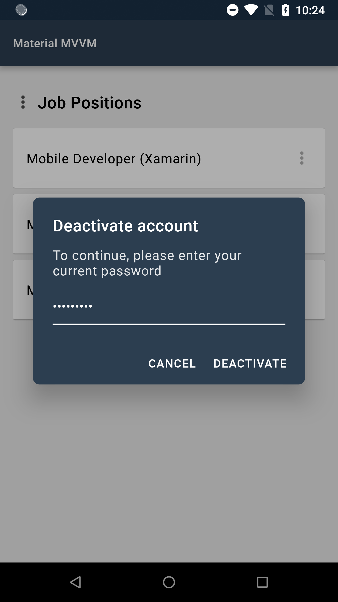

# XF.Material Library [](https://github.com/contrix09/XF-Material-Library/blob/master/RELEASE_NOTES.md) [](https://dev.azure.com/compiledevops/XF.Material/_build/latest?definitionId=20)

A Xamarin.Forms library for Xamarin.Android and Xamarin.iOS to implement [Google's Material Design](https://material.io/design).

## Contents

- [Getting Started](#getting-started)
- [Features](#features)
  - [Material UI](#material-ui)
    - [App Bar Customization](#app-bar-customization)
    - [Cards](#cards)
    - [Buttons](#buttons)
    - [Text Fields](#text-fields)
    - [Selection Controls](#selection-controls)
    - [Menus](#menus)
    - [Slider](#slider)
    - [Chips](#chips)
    - [Circular Progress Indicator](#circular-progress-indicator)
    - [Tintable Image Icon](#tintable-image-icon)
  - [Material Dialogs](#material-dialogs)
    - [Alert Dialog](#alert-dialog)
    - [Simple Dialog](#simple-dialog)
    - [Confirmation Dialog](#confirmation-dialog)
    - [Input Dialog](#input-dialog)
    - [Loading Dialog](#loading-dialog)
    - [Snackbar](#snackbar)
    - [Styling Dialogs](#styling-dialogs)
  - [Material Resources](#material-resources)
    - [Color](#color)
    - [Typography](#typography)
    - [Adding the Material Resources](#adding-the-material-resources)
    - [Retrieving a Material Resource](#retrieving-a-material-resource)
  - [Changing the Status Bar Color](#changing-the-status-bar-color)
- [Android Compatibility Issues](#android-compatibility-issues)
- [Thanks and Appreciation](#thanks-and-appreciation)

## Getting Started
1. Download the current version through [NuGet](https://www.nuget.org/packages/XF.Material) and install it in your Xamarin.Forms projects.
2. Call the `Material.Init()` method in each project:

```c#
//Xamarin.Forms

public App()
{
    this.InitializeComponent();
    XF.Material.Forms.Material.Init(this);
}

//Xamarin.Android

protected override void OnCreate(Bundle savedInstanceState)
{
    TabLayoutResource = Resource.Layout.Tabbar;
    ToolbarResource = Resource.Layout.Toolbar;

    base.OnCreate(savedInstanceState);

    Xamarin.Forms.Forms.Init(this, savedInstanceState);
    XF.Material.Droid.Material.Init(this, savedInstanceState);

    this.LoadApplication(new App());
}

//Xamarin.iOS

public override bool FinishedLaunching(UIApplication app, NSDictionary options)
{
    Xamarin.Forms.Forms.Init();
    XF.Material.iOS.Material.Init();
    this.LoadApplication(new App());

    return base.FinishedLaunching(app, options);
}

```

3. Configure your application's color and font resources. Read more about it [here](#material-resources).

### Additional configuration for iOS

In order to be able to change the status bar's colors using [this](#changing-the-status-bar-color) or by setting your app colors [here](#adding-the-material-resources), add this to your `info.plist` file:

```xml
<key>UIViewControllerBasedStatusBarAppearance</key>
<false/>
```

## Features

### Material UI
Under the `XF.Material.Forms.UI` namespace, the library offers a number of controls available.

#### App Bar Customization
You can customize the appearance of the App Bar by using the `MaterialNavigationPage` control.

| Code | Android  | iOS |
| ------------- | ------------- | ------------- |
|`<ContentPage .... xmlns:material="clr-namespace:XF.Material.Forms.UI;assembly=XF.Material.Forms" material:MaterialNavigationPage.AppBarColor="#2c3e50" material:MaterialNavigationPage.AppBarTitleTextFontFamily="Roboto" material:MaterialNavigationPage.AppBarTitleTextFontSize="14" material:MaterialNavigationPage.StatusBarColor="#1B3147" material:MaterialNavigationPage.AppBarTitleTextAlignment="Start" /* Content goes here * </ ContentPage>` || |


##### Attached Properties
These are attached properties that can be used on pages that are navigated through the `MaterialNavigationPage` control.

1. `AppBarColor` - The color of the app bar.

2. `AppBarTitleTextAlignment` - The text alignment of the app bar title. The default value is `TextAlignment.Start`.

3. `AppBarTitleTextColor` - The text color of the app bar title. The default value is `Material.Color.OnPrimary`.

4. `AppBarTitleFontFamily` - The font family of the app bar title. The default value is `Material.FontFamily.H6`.

5. `AppBarTitleFontSize` - The font size of the app bar title. The default value is  `20`.

6. `StatusBarColor` - The color of the status bar.

7. `HasShadow` - The `boolean` value whether the App Bar will draw a shadow or not.

##### Usage and Behavior
This control uses the new feature of Xamarin 3.3, the `TitleView` property, to be able to change the appearance of the app bar title.
But when the `TitleView` property is set on a page, the attached properties will not work.

It is also important to note that when the attached properties are used, any change in these properties will only be detected during before pushing and popping of pages.


#### Cards

Cards contain content and actions about a single subject.

| Code | Android  | iOS |
| ------------- | ------------- | ------------- |
| ` <material:MaterialCard CornerRadius="2" Elevation="1" HeightRequest="80" HorizontalOptions="FillAndExpand" /> ` || |

##### Property

`MaterialCard` inherits the `Frame` class.
- `Elevation` - The virtual distance along the z-axis. The value determines the importance of the content pesented in this view. The default value is `1`.

##### Usage

Cards are surfaces that display content and actions on a single topic. They should be easy to scan for relevant and actionable information. Elements, like text and images, should be placed on them in a way that clearly indicates hierarchy.

Read more about cards [here](https://material.io/design/components/cards.html).

#### Buttons

Buttons allow users to take actions, and make choices, with a single tap.

There are two types of buttons you can use: `MaterialButton` and `MaterialIconButton`

| Code | Android  | iOS |
| ------------- | ------------- | ------------- |
| `<material:MaterialButton BackgroundColor="#EAEAEA" HorizontalOptions="Center" Text="Elevated Button" TextColor="Black" VerticalOptions="Center" /> ` || |

##### Properties

`MaterialButton` inherits the `Button` class. `MaterialIconButton` inherits the `ContentView` class.

Both of these controls have these common properties:

1. `ButtonType` - The type of the button. The default value is `Elevated`.

    - `Elevated` - This button will cast a shadow.
    - `Flat` - This button will have no shadow.
    - `Outlined` - This button will have no shadow, has a transparent background, and has a border.
    - `Text` - This button will only show its label. It will not have a shadow, has a transparent background, and no border. *Text buttons has a smaller inner padding as compared to the other button types.*

2. `BackgroundColor` - The color of the button's background. *Outlined and Text button types will always have a transparent background color. Flat and elevated buttons have a default background color based on the value of `MaterialColorConfiguration.Secondary`.*

3. `PressedBackgroundColor` - The color of the button's background when it is pressed.

4. `DisabledBackgroundColor` - The color of the button's background when it is disabled.

`MaterialButton` have these properties:

1. `Image` - The icon to be displayed next to the button's label. The color of the icon will be based on the `TextColor` property value of the button.

2. `AllCaps` - Whether the letters in the label of the button should be in upper case or not. By default, this is set to `true`.

`MaterialIconButton` has this property:

1. `Image` - The image of the button.

2. `TintColor` - The tint color of the image.

##### Usage & Behavior
Buttons communicate actions that users can take. They are typically placed throughout your UI.

- `Elevated` and `Flat`

    
    
    These are high-emphasis buttons that are distinguished by their fill color and/or shadow. The actions bound to them are primary to your app.

- `Outlined`

    
    
    These are medium-emphasis buttons. The actions bound to them are important, but are not the primary action in an app.

- `Text`

    
    
    These buttons are typically used for less-pronounced actions, which are located in modal dialogs or in cards.

On press, buttons display touch feedback (ripple effect).

Read more about buttons [here](https://material.io/design/components/buttons.html).

#### Text Fields
Text fields allow users to enter and edit text.

| Code | Android  | iOS |
| ------------- | ------------- | ------------- |
| `<material:MaterialTextField Placeholder="Placeholder" HelperText="Helper Text" ErrorText="Error Text" Text="Input Text" InputType="Default" />`|| |

##### Properties

`MaterialTextField` inherits the `ContentView` class.

1. `AlwaysShowUnderline` - Boolean flag determines whether the underline accent of this text field should always show or not. The default value is `false`.

2. `BackgroundColor` - The background color of the text field. Default hex color value is `#DCDCDC`.

3. `ErrorColor` - The color to indicate an error in the text field. The default value is based on the color value of `MaterialColorConfiguration.Error`.

4. `ErrorText` - The text that will show to indicate an error in this text field. This will replace `HelperText` when `HasError` is set to `true`.

5. `FocusCommand` - The command that will be executed when this text field receives or loses focus.

6. `HasError` - Boolean flag that indicates whether an error has occurred or not in this text field.

7. `HelperText` - The text that appears below the text field to indicate additional hints for the text field.

8. `HelperTextColor` - The color of the helper text. The default hex color value is `#99000000`.

9. `HelperTextFontFamily` - The font family of the helper text. The `ErrorText` will use this as its font family.

10. `Icon` - The image icon that will show on the left side of this text field.

11. `IconTintColor` - The color to be used to tint the icon image of this text field. The default hex color value is `#99000000`.

12. `InputType` - The keyboard input type to be used for this text field.

13. `MaxLength` - The maximum allowed number of characters in this text field.

14. `Placeholder` - The placeholder text of this text field. This property must never be null or empty.

15. `PlaceholderColor` - The color of the placeholder text. The default hex color value is `#99000000`.

16. `ReturnType` -  The appearance of the return button of the keyboard.

17. `ReturnCommand` - The command that will run when the user returns the input.

18. `ReturnCommandParameter` - The parameter to be passed in `ReturnCommand` property when it is executed.

19. `Text` - The input text of this text field.

20. `TextChangeCommand` - The command that executes when there is a change in this text field's input text.

21. `TextColor` - The color of the input text. The default hex color value is `#D0000000`.

22. `TextFontFamily` - The font family of the input text. By default, it uses the `MaterialFontConfiguration.Body2` font family.

23. `TintColor` - The tint color of the underline accent and the placeholder of this text field when focused. The default color is set to the value of `MaterialColorConfiguration.SecondaryColor`.

24. `FloatingPlaceholderEnabled` - Determines whether the placeholder should float above when the text field is focused.

25. `Choices` - When the `InputType` property is set to `MaterialInputType.Choice`, provides the list of choices from which the user will select one.

26. `HasHorizontalPadding` - Boolean flag determines whether the left and right bounds of the text field should be padded or not.

##### Events

1. `Focused` - Raised when this text field receives or loses focus.

2. `TextChanged` - Raised when the input text of this text field has changed.

##### Usage and Behavior

A text field container, by default, has a fill. You can make the text field's `BackgroundColor` transparent and `AlwaysShowUnderline` to `true`.

The placeholder text should always be visible, because it is used to inform users as to what information is requested for a text field.

Helper text conveys additional guidance about the input field, such as how it will be used. It should only take up a single line, being persistently visible or visible only on focus.

When input text isn’t accepted, an error text can display instructions on how to fix it. Error messages are displayed below the input line, replacing helper text until fixed.

Read more about text fields [here](https://material.io/design/components/text-fields.html#usage).

#### Selection Controls
Selection controls allow users to complete tasks that involve making choices such as selecting 
options, or switching settings on or off. Selection controls are found on screens that ask 
users to make decisions or declare preferences such as settings or dialogs.

##### Radio Buttons
Allow users to select one option from a set.

| Code | Android  | iOS |
| ------------- | ------------- | ------------- |
| `<material:MaterialRadioButtonGroup x:Name="radioButtonGroup" Choices="{Binding Jobs}" /> ` || |

###### Properties

1. `Choices` - The list of string the user will choose from.

2. `FontFamily` - The font family of the text of each radio buttons. The default is the value of `MaterialFontConfiguration.Body1`.

3. `FontSize` - The font size of the text of each radio buttons. The default value is `16`.

4. `HorizontalSpacing` - The spacing between the radio button and its text.

5. `SelectedColor` - The color that will be used to tint this control whe selected. The default is the value of `MaterialColorConfiguration.Secondary`.

6. `SelectedIndex` - The index of the selected choice.

7. `SelectedIndexChanged` - Raised when there is a change in the control's selected index.

8. `SelectedIndexChangedCommand` - The command that wil run if there is a change in the control's selected index. The parameter is the selected index.

9. `TextColor` - The color of the text of each radio button. The default value is `#DE000000`.

10. `UnselectedColor` - The color that will be used to tint this control when unselected. The default value is `#84000000`.

11. `VerticalSpacing` - The spacing between each radio buttons.

###### Usage and Behavior
Use radio buttons when the user needs to see all available options. The orientation of the radio buttons is limited to vertical position, since
the custom view used to present the radio buttons is a `ListView`, but the scroll bars will not show since the `ListView`'s height is based on the number
of choices. Each radio button has a fixed height of `48`.

##### Checkboxes
Checkboxes allow the user to select one or more items from a set.

| Code | Android  | iOS |
| ------------- | ------------- | ------------- |
| `<material:MaterialCheckboxGroup x:Name="checkBoxGroup" Choices="{Binding Jobs}" /> ` || |

###### Properties

1. `Choices` - The list of string the user will choose from.

2. `FontFamily` - The font family of the text of each checkboxes. The default is the value of `MaterialFontConfiguration.Body1`.

3. `FontSize` - The font size of the text of each checkboxes. The default value is `16`.

4. `HorizontalSpacing` - The spacing between the checkbox and its text.

5. `SelectedColor` - The color that will be used to tint this control whe selected. The default is the value of `MaterialColorConfiguration.Secondary`.

6. `SelectedIndices` - The indices of the selected choices.

7. `SelectedIndicesChanged` - Raised when there is a change in the control's selected inices.

8. `SelectedIndicesChangedCommand` - The command that wil run if there is a change in the control's selected indices. The parameter is the list of selected indices.

9. `TextColor` - The color of the text of each radio button. The default value is `#DE000000`.

10. `UnselectedColor` - The color that will be used to tint this control when unselected. The default value is `#84000000`.

11. `VerticalSpacing` - The spacing between each checkboxes.


###### Usage and Behavior
It has the same limitations as `MaterialRadioButtonGroup`.

Checkboxes can be used to turn an option on or off.  If there is only one option, you can use `MaterialCheckbox` instead.

`MaterialCheckbox` has the property `IsSelected`, you can use this to determine whether the option was selected or not.

#### Menus
Menus display a list of choices on temporary surfaces.

| Code | Android  | iOS |
| ------------- | ------------- | ------------- |
| `<material:MaterialMenuButton ButtonType="Text" CornerRadius="24" Choices="{Binding Actions}" Command="{Binding MenuCommand}" />`|| |

##### Properties

`MaterialMenuButton` inherits the `XF.Material.Forms.UI.MaterialIconButton` class.

1. `Choices` - The list of items from which the user will choose from. You can either assign a collection of `string` or `MaterialMenuItem`.

2. `MenuBackgroundColor` - The background color of the menu.

3. `MenuCornerRadius` - The corner radius of the menu.

4. `Command` - The command that will execute when a menu item was selected. The type is `Command<MaterialMenuResult>`. The result will contain the index of the selected menu and the parameter, if any.

5. `CommandParameter` -  The parameter to pass in `Command` property.

6. `MenuTextColor` - The text color of the menu items.

7. `MenuTextFontFamily` - The text font family of the menu items.

##### Event

1. `MenuSelected` - Raised when a menu item was selected.

##### Usage and Behavior
Menus are positioned relative to both the element that generates them and the edges of the screen. They can appear in front of, beside, above, or below the element that generates them.

Menus can be dismissed by tapping outside, when an item was selected, or when the back button was pressed in Android.

Be sure to always match the width and height of the child view to the width and height of the menu.

#### Slider
Sliders allow users to make selections from a range of values.

```xml
<mat:MaterialSlider Value="{Binding CurrentValue}" MinValue="0" MaxValue="100" />
```

##### Properties
`MaterialSlider` inherits the `ContentView` class.

1. `Value` - The current value selected.

2. `MinValue` -  The minimum value allowed to select.

3. `MaxValue` - The maximum value allowed to select.

4. `ValueChangedCommand` - The command that will execute when the current value has changed.

5. `TrackColor` - The track color of the slider.

6. `ThumbColor` - The thumb color of the slider.

##### Event

1. `ValueChanged` - The event that is raised when the current value has changed.

#### Chips
Chips are compact elements that represent an input, attribute, or action.

| Code | Android  | iOS |
| ------------- | ------------- | ------------- |
| `<material:MaterialChip BackgroundColor="#F2F2F2" Image="im_google" Text="Google" TextColor="#DE000000" /> ` || |

##### Properties

`MaterialChip` inherits the `ContentView` class.

1. `Text` - The chip's label to be displayed.

2. `TextColor` - The color of the chip's label.

3. `FontFamily` - The font family of the chip's label.

4. `BackgroundColor` - The color of the chip's background.

5. `Image` - The chip's image to be displayed.

6. `ActionImage` - The chip's action image to be displayed.

7. `ActionImageTappedCommand` - The bindable command that executes when the `ActionImage` of the chip is tapped.

##### Event
1. `ActionImageTapped` - The event that is called when the `ActionImage` of the chip is tapped.

##### Usage and Behavior

Chips allow users to enter information, make selections, filter content, or trigger actions.

Read more about chips [here](https://material.io/design/components/chips.html).

#### Circular Progress Indicator
An indeterminate progress indicator that express an unspecified wait time of a process.

##### Code

```xml
<material:MaterialCircularLoadingView WidthRequest="56"
    HeightRequest="56"
    TintColor="#6200EE" />
```

##### Properties

`MaterialCircularLoadingView` inherits the `Lottie.Forms.AnimationView` class.

1. `TintColor` - The color of the circular progress indicator.

##### Usage & Behavior

Circular progress indicators display progress by animating an indicator along an invisible circular track in a clockwise direction. They can be applied directly to a surface, such as a button or card.

[Loading Dialog](###Loading-Dialog) uses this to indicate a process running.

Read more about circular progress indicator [here](https://material.io/design/components/progress-indicators.html#circular-progress-indicators).

#### Tintable Image Icon
A tintable image view.

##### Code

```xml
<material:MaterialIcon WidthRequest="56"
    HeightRequest="56"
    Source="ic_save"
    TintColor="#6200EE" />
```

##### Properties

`MaterialIcon` inherits the `Image` class.

1. `TintColor` - The tint color of the image.

### Material Dialogs

Under the `XF.Material.Forms.UI.Dialogs` namespace, you can display modal views to notify users by using `MaterialDialog.Instance`.

#### Alert Dialog
Alert dialogs interrupt users with urgent information, details, or actions.

| Android  | iOS |
| ------------- | ------------- |
|| |

##### Code
You can show an alert dialog using any of the following overload methods of `MaterialDialog.Instance.AlertAsync()` or `MaterialDialog.Instance.ConfirmAsync()`.

There are two common parameters in this method:

1. `message` - The message of the alert dialog.

2. `title` - The title of the alert dialog.

- Shows an alert dialog for acknowledgement. It only has a single, dismissive action used for acknowledgement.

    ```c#
    await MaterialDialog.Instance.AlertAsync(message: "This is an alert dialog.");

    await MaterialDialog.Instance.AlertAsync(message: "This is an alert dialog", 
                                        title: "Alert Dialog");
    
    await MaterialDialog.Instance.AlertAsync(message: "This is an alert dialog", 
                                        title: "Alert Dialog", 
                                        acknowledgementText: "Got It");
    ```
    
    - `acknowledgementText` - The text of the alert dialog's acknowledgement button. The default string value is `Ok`.

- Showing an alert dialog for confirmation of action. Returns true when the confirm button was clicked, false if the dismiss button was clicked or if the alert dialog was dismissed.

    ```c#
    await MaterialDialog.Instance.ConfirmAsync(message: "Do you want to sign in?", 
                                        confirmingText: "Sign In");

    await MaterialDialog.Instance.ConfirmAsync(message: "Do you want to sign in?", 
                                        confirmingText: "Sign In", 
                                        dismissiveText: "No");

    await MaterialDialog.Instance.ConfirmAsync(message: "Discard draft?", 
                                        title: "Confirm", 
                                        confirmingText: "Yes", 
                                        dismissiveText: "No");
    ```

    - `confirmingText` - The text of the alert dialog's confirmation button.
    
    - `dismissiveText` - The text of the alert dialog's dismissive button. The default string value is `Cancel`.


##### Usage & Behavior

An alert dialog is displayed by pushing a modal window. This will appear in front of the content of the app to provide critical information or ask for a decision.

Alert dialogs are interruptive. This means that it disables all app functionality when they appear, and remain on screen until confirmed, dismissed or a required action has been taken.

Alert dialogs may be dismissed by tapping outside of the dialog, tapping the dismissive button (e.g. "Cancel" button), or by tapping the system back button (for Android).

Read more about alert dialogs [here](https://material.io/design/components/dialogs.html#alert-dialog).

##### Handling the Back Button on Android

In order for the back button to work on Android for dismissing alert dialogs, override the `OnBackPressed` method in your `MainActivity` class and add this:

```c#
public override void OnBackPressed()
{
    XF.Material.Droid.Material.HandleBackButton(base.OnBackPressed);
}
```

#### Simple Dialog
Simple dialogs can display items that are immediately actionable when selected. They don’t have text buttons.

| Android  | iOS |
| ------------- | ------------- |
|| |

##### Code
You can show a simple dialog by using any of the overload methods of `MaterialDialog.Instance.SelectActionAsync()`.

```c#

//Create actions
var actions = new string[]{ "Open in new tab", "Open in new window", "Copy link address", "Download link" };

//Show simple dialog
var result = await MaterialDialog.Instance.SelectActionAsync(actions: actions);

//Show simple dialog with title
var result = await MaterialDialog.Instance.SelectActionAsync(title: "Select an action", 
                                                             actions: actions);

```

##### Usage & Behavior
Simple dialogs are dismissed by tapping an action, or by tapping outside the dialog.

Read more about alert dialogs [here](https://material.io/design/components/dialogs.html#alert-dialog).

#### Confirmation Dialog
Confirmation dialogs give users the ability to provide final confirmation of a choice before committing to it, 
so they have a chance to change their minds if necessary.

| Android  | iOS |
| ------------- | ------------- |
|| |

##### Code
You can show two types of confirmation dialog: Choose one of listed choices using `MaterialDialog.Instance.SelectChoiceAsync()`, and choose one or more of listed choices using `MaterialDialog.Instance.SelectChoicesAsync()`.

```c#
//Create choices
var jobs = new string[]
{
    "Mobile Developer (Xamarin)",
    "Mobile Developer (Native)",
    "Web Developer (.NET)",
    "Web Developer (Laravel)",
    "Quality Assurance Engineer",
    "Business Analyst",
    "Recruitment Officer",
    "Project Manager",
    "Scrum Master"
};

//Show confirmation dialog for choosing one.
var result = await MaterialDialog.Instance.SelectChoiceAsync(title: "Select a job", 
                                                             choices: jobs);

//Show confirmation dialog for choosing one or more.
var result = await MaterialDialog.Instance.SelectChoicesAsync(title: "Select a job", 
                                                              choices: jobs);
```

You can also define pre-selected choice/s by supplying the parameters `selectedIndex` and `selectedIndices` for `MaterialDialog.Instance.SelectChoiceAsync()` and `MaterialDialog.Instance.SelectChoicesAsync()`, respectively.

```c#
...

//Show confirmation dialog for choosing one, with pre-selected choice.
var result = await MaterialDialog.Instance.SelectChoiceAsync(title: "Select a job", 
                                                             selectedIndex: 1,
                                                             choices: jobs);

//Show confirmation dialog for choosing one or more, with pre-selected choices.
var result = await MaterialDialog.Instance.SelectChoicesAsync(title: "Select a job", 
                                                              selectedIndices: new int[] { 1, 0 },
                                                              choices: jobs);

```

##### Usage and Behavior
Confirmation dialogs provide both confirmation and cancel buttons. After a confirmation button is tapped, a selection is confirmed. 
If the cancel button is tapped, or the area outside the dialog, the action is cancelled.

The confirmation button will only be enabled when an item is selected.

#### Input Dialog
A type of confirmation dialog that allow users to input text and confirm it.

| Android  | iOS |
| ------------- | ------------- |
|| |

##### Code
You can show an input dialog by calling any of the overload methods of `MaterialDialog.Instance.InputAsync()`.

```c#

var input = await MaterialDialog.Instance.InputAsync();

```

##### Usage and Behavior
Just like confirmation dialogs, input dialogs also provide confirmation and cancel buttons. It will return the string value of the input field if the confirm button was clicked. If the cancel button is tapped, or the area outside the dialog, the action is cancelled.


#### Loading Dialog
A modal dialog that is displayed to inform users about a process that is running for an unspecified time.

| Android  | iOS |
| ------------- | ------------- |
|| |

##### Code

You can show a loading dialog using either of two ways:

- Show in a `using` block. The loading dialog will automatically dispappear when the task/s are done.
```c#
using(await MaterialDialog.Instance.LoadingDialogAsync(message: "Something is running"))
{
    await Task.Delay(5000) // Represents a task that is running.
}
```

- Show by calling the method and assign the return value to a variable, then call the `Dispose` method of the variable to hide the loading dialog after all task/s are done.

```c#
var loadingDialog = await MaterialDialog.Instance.LoadingDialogAsync(message: "Something is running");

await Task.Delay(5000) // Represents a task that is running.

await loadingDialog.DismissAsync();
```

- Change the dialog text.
```c#
using(var dialog = await MaterialDialog.Instance.LoadingDialogAsync(message: "Something is running"))
{
    await Task.Delay(5000) // Represents a task that is running.
    dialog.Text = "Something else is running now!";
    await Task.Delay(5000) // Represents a task that is running.
}
```


##### Usage & Behavior

Show a loading dialog to inform users of a running process in your app.

A loading dialog can never be dismissed by user interaction, even by using Android's back button.

#### Snackbar
Snackbars provide brief messages about app processes at the bottom of the screen.

| Android  | iOS |
| ------------- | ------------- |
|| |

##### Code

You can show a snackbar by using either of the two overload methods of `MaterialDialog.Instance.SnackbarAsync()`.

Both methods have this default parameter `message`, which is the message that will display on the snackbar.

- Shows a snackbar with no action. 
    ```c#
    await MaterialDialog.Instance.SnackbarAsync(message: "This is a snackbar.", 
                                                msDuration: MaterialSnackbar.DurationLong);
    ``` 
    - `msDuration` -  The duration, in milliseconds, before the snackbar will disappear. There are pre-defined constants which you can use  in the `MaterialSnackbar` class.
        - `MaterialSnackbar.DurationShort` - Snackbar will show for 1500 milliseconds.
        
        - `MaterialSnackbar.DurationLong` - Snackbar will show for 2750 milliseconds. The default value of `msDuration`.
        
        - `MaterialSnackbar.DurationIndefinite` - Snackbar will show indefinitely.

- Shows a snackbar with an action. Returns true if the snackbar's action button was clicked, or false if the snackbar was automatically dismissed.
    ```c#
    await MaterialDialog.Instance.SnackbarAsync(message: "This is a snackbar.",
                                                actionButtonText: "Got It",
                                                msDuration: 3000);
    ```
    - `actionButtonText` - The text that will appear on the snackbar's button.

You can also use a snackbar to indicate a task/s running without interrupting the user. You can use the `MaterialDialog.Instance.LoadingSnackbarAsync()` method.

There are two ways to display a loading snackbar.

- Show in a `using` block. The loading dialog will automatically dispappear when the task/s are done.
```c#
using(await MaterialDialog.Instance.LoadingSnackbarAsync(message: "Something is running"))
{
    await Task.Delay(5000) // Represents a task that is running.
}
```

- Show by calling the method and assign the return value to a variable, then call the `Dispose` method of the variable to hide the snackbar after all task/s are done.

```c#
var snackbar = await MaterialDialog.Instance.LoadingSnackbarAsync(message: "Something is running");

await Task.Delay(5000) // Represents a task that is running.

await snackbar.DismissAsync();
```

- Change the dialog text.
```c#
using(var snackbar = await MaterialDialog.Instance.LoadingSnackbarAsync(message: "Something is running"))
{
    await Task.Delay(5000) // Represents a task that is running.
    snackbar.Text = "Something else is running now!";
    await Task.Delay(5000) // Represents a task that is running.
}
```

##### Usage & Behavior

Snackbars can be used to inform users of a process that an app has performed, will perform, or is performing. They can appear temporarily towards the bottom of the screen. Only one snackbar may be displayed at a time.

A snackbar can contain a single action. When setting the duration of how long before it disappears automatically, the action shouldn't be "Dismiss" or "Cancel".

Read more about snackbars [here](https://material.io/design/components/snackbars.html).

#### Styling Dialogs

You can customize modal dialogs that are shown using `MaterialDialog.Instance`. 

`BaseMaterialDialogConfiguraion`, which the classes `MaterialAlertDialogConfiguration`, `MaterialLoadingDialogConfiguration`, and `MaterialSnackbarConfiguration` inherits, has these properties:

1. `BackgroundColor` - The background color of the dialog. The default value is `Color.White`.

2. `CornerRadius` - The roundness of the dialog's corners. The default value is `2`. For `MaterialSnackbarConfiguration`, the value is `4`.

3. `MessageFontFamily` - The font family of the dialog's message. The default value is set to the value of `MaterialFontConfiguration.Body1`. For `MaterialSnackbarConfiguration`, the default value is set to the value of `MaterialFontConfiguration.Body2`.

4. `MessageTextColor` - The color of the dialog's message. The default value is `#99000000`. For `MaterialSnackbarConfiguration`, the default value is `#DEFFFFFF`
.
5. `ScrimColor` - The color that will appear at the back of this dialog. The default value is `#51000000`. For `MaterialSnackbarConfiguration`, the value is `Color.Transparent`.

6. `TintColor` - The color to tint views such as buttons and images. The default value is set to the value of `MaterialColorConfiguration.Secondary`. For `MaterialSnackbarConfiguration`, the default value is `Color.Yellow`.

##### Styling Alert Dialogs

`MaterialAlertDialogConfiguration` class provides properties to be used for customizing an alert dialog. You can pass an instance of this class to any overload methods of `MaterialDialog.Instance.AlertAsync()`.

The properties of `MaterialAlertDialogConfiguration` class are:

1. `TitleTextColor` - The color of the alert dialog's title. The default color hex value is `#DE000000`;

2. `TitleFontFamily` - The font family of the alert dialog's title. The default value is set to the value of `MaterialFontConfiguration.H6`.

3. `ButtonFontFamily` - The font family of the alert dialog's button/s. The default value is set to the value of `MaterialFontConfiguration.Button`.

4. `ButtonAllCaps` - The boolean value whether the text of the alert dialog's button/s should all be capitalized or not. The default value is `true`.

```C#
var alertDialogConfiguration = new MaterialAlertDialogConfiguration
{
    BackgroundColor = XF.Material.Forms.Material.GetResource<Color>(MaterialConstants.Color.PRIMARY),
    TitleTextColor = XF.Material.Forms.Material.GetResource<Color>(MaterialConstants.Color.ONPRIMARY),
    TitleFontFamily = XF.Material.Forms.Material.GetResource<OnPlatform<string>>("FontFamily.Exo2Bold"),
    MessageTextColor = XF.Material.Forms.Material.GetResource<Color>(MaterialConstants.Color.ONPRIMARY).MultiplyAlpha(0.8),
    MessageFontFamily = XF.Material.Forms.Material.GetResource<OnPlatform<string>>("FontFamily.OpenSansRegular"),
    TintColor = XF.Material.Forms.Material.GetResource<Color>(MaterialConstants.Color.ONPRIMARY),
    ButtonFontFamily = XF.Material.Forms.Material.GetResource<OnPlatform<string>>("FontFamily.OpenSansSemiBold"),
    CornerRadius = 8,
    ScrimColor = Color.FromHex("#232F34").MultiplyAlpha(0.32),
    ButtonAllCaps = false
};

await MaterialDialog.Instance.AlertAsync(message: "This is an alert dialog",
                                         title: "Alert Dialog",
                                         acknowledgementText: "Got It",
                                         configuration: alertDialogConfiguration);
```
<br />


#### Styling Simple Dialogs
`MaterialSimpleDialogConfiguration` class provides properties to be used for customizing a simple dialog. You can pass an instance of this class to any overload methods of `MaterialDialog.Instance.SelectActionAsync()`.

```c#
var simpleDialogConfiguration = new MaterialSimpleDialogConfiguration
{
    BackgroundColor = XF.Material.Forms.Material.GetResource<Color>(MaterialConstants.Color.PRIMARY),
    TitleTextColor = XF.Material.Forms.Material.GetResource<Color>(MaterialConstants.Color.ON_PRIMARY),
    TitleFontFamily = XF.Material.Forms.Material.GetResource<OnPlatform<string>>("FontFamily.OpenSansSemiBold"),
    TextColor = XF.Material.Forms.Material.GetResource<Color>(MaterialConstants.Color.ON_PRIMARY).MultiplyAlpha(0.8),
    TextFontFamily = XF.Material.Forms.Material.GetResource<OnPlatform<string>>("FontFamily.OpenSansRegular"),
    CornerRadius = 8,
    ScrimColor = Color.FromHex("#232F34").MultiplyAlpha(0.32)
};

var result = await MaterialDialog.Instance.SelectActionAsync(title: "Select an action",
                                                             actions: new string[] { "Open in new tab", "Open in new window", "Copy link address", "Download link" },
                                                             configuration: simpleDialogConfiguration);
```

<br />


#### Styling Confirmation Dialogs
`MaterialConfirmationDialogConfiguration` class provides properties to be used for customizing a confirmation dialog. You can pass an instance of this class to any overload methods of `MaterialDialog.Instance.SelectChoiceAsync()` or `Material.Instance.SelectChoicesAsync()`.

```c#
var confirmationDialogConfiguration = new MaterialConfirmationDialogConfiguration
{
    BackgroundColor = XF.Material.Forms.Material.GetResource<Color>(MaterialConstants.Color.PRIMARY).AddLuminosity(-0.1),
    TitleTextColor = XF.Material.Forms.Material.GetResource<Color>(MaterialConstants.Color.ON_PRIMARY),
    TitleFontFamily = XF.Material.Forms.Material.GetResource<OnPlatform<string>>("FontFamily.OpenSansSemiBold"),
    TextColor = XF.Material.Forms.Material.GetResource<Color>(MaterialConstants.Color.ON_PRIMARY).MultiplyAlpha(0.8),
    TextFontFamily = XF.Material.Forms.Material.GetResource<OnPlatform<string>>("FontFamily.OpenSansRegular"),
    CornerRadius = 8,
    ButtonAllCaps = false,
    ButtonFontFamily = XF.Material.Forms.Material.GetResource<OnPlatform<string>>("FontFamily.OpenSansSemiBold"),
    ControlSelectedColor = Color.White,
    ControlUnselectedColor = Color.White.MultiplyAlpha(0.66),
    TintColor = Color.White,
    ScrimColor = Color.FromHex("#232F34").MultiplyAlpha(0.32)
};

var result = await MaterialDialog.Instance.SelectChoiceAsync(title: "Select a  job",
                                                             choices: /*choices list*/,
                                                             configuration: confirmationDialogConfiguration);
```

<br />


#### Styling Input Dialogs
`MaterialInputDialogConfiguration` class provides properties to be used for customizing an input dialog.
You can pass an instance of this class to any overload methods of `MaterialDialog.Instance.InputAsync()`.

The input type of the input field can be set by using this configuration.

```c#
var config = new MaterialInputDialogConfiguration
{
    InputType = MaterialTextFieldInputType.Password,
    CornerRadius = 8,
    BackgroundColor = Color.FromHex("#2c3e50"),
    InputTextColor = Color.White,
    InputPlaceholderColor = Color.White.MultiplyAlpha(0.6),
    TintColor = Color.White,
    TitleTextColor = Color.White,
    MessageTextColor = Color.FromHex("#DEFFFFFF")
};

var input = await MaterialDialog.Instance.InputAsync(title: "Deactivate account",
                                                     message: "To continue, please enter your current password",
                                                     inputPlaceholder: "Password",
                                                     confirmingText: "Deactivate",
                                                     configuration: config);
```

<br />


#### Styling Loading Dialogs

`MaterialLoadingDialogConfiguration` class provides properties to be used for customizing a loading dialog. You can pass an instance of this class to any overload methods of `MaterialDialog.Instance.LoadingDialogAsync()`.

```c#
var loadingDialogConfiguration = new MaterialLoadingDialogConfiguration
{
    BackgroundColor = XF.Material.Forms.Material.GetResource<Color>(MaterialConstants.Color.PRIMARY),
    MessageTextColor = XF.Material.Forms.Material.GetResource<Color>(MaterialConstants.Color.ONPRIMARY).MultiplyAlpha(0.8),
    MessageFontFamily = XF.Material.Forms.Material.GetResource<OnPlatform<string>>("FontFamily.OpenSansRegular"),
    TintColor = XF.Material.Forms.Material.GetResource<Color>(MaterialConstants.Color.ONPRIMARY),
    CornerRadius = 8,
    ScrimColor = Color.FromHex("#232F34").MultiplyAlpha(0.32)
};

await MaterialDialog.Instance.LoadingDialogAsync(message: "Something is running...",
                                                 configuration: loadingConfiguration);
```
<br />


#### Styling Snackbars

`MaterialSnackbarConfiguration` class provides properties to be used for customizing a snackbar. You can pass an instance of this class to any overload methods of `MaterialDialog.Instance.SnackbarAsync()` or `MaterialDialog.Instance.LoadingSnackbarAsync()`.

```c#
var snackbarConfiguration = new MaterialSnackbarConfiguration            
{
    BackgroundColor = XF.Material.Forms.Material.GetResource<Color>(MaterialConstants.Color.PRIMARY),
    MessageFontFamily = XF.Material.Forms.Material.GetResource<OnPlatform<string>>("FontFamily.OpenSansRegular"),
    ButtonAllCaps = true,
    ButtonFontFamily = XF.Material.Forms.Material.GetResource<OnPlatform<string>>("FontFamily.OpenSansSemiBold"),
    TintColor = Color.White,
    MessageTextColor = XF.Material.Forms.Material.GetResource<Color>(MaterialConstants.Color.ONPRIMARY).MultiplyAlpha(0.8)
}

await MaterialDialog.Instance.SnackbarAsync(message: "This is a snackbar."
                                            actionButtonText:  "Got It",
                                            configuration: snackbarConfiguration);
```
<br />


#### Setting a global style for each type of dialogs

You can set the global styles of each dialog by using the `MaterialDialog.Instance.SetGlobalStyles()` method.

```c#
MaterialDialog.Instance.SetGlobalStyles(new MaterialAlertDialogConfiguration
{
    //Configure properties
},
new MaterialLoadingDialogConfiguration
{
    //Configure properties
}, 
new MaterialSnackbarConfiguration
{
    //Configure properties
},
new MaterialSimpleDialogConfiguration
{
    //Configure properties
},
new MaterialConfirmationDialogConfiguration
{
    //Configure properties
},
new MaterialInputDialogConfiguration
{
    //Configure properties
});
```

You can still override these styles be passing the configuration object when showing an alert dialog, loading dialog, simple dialog, confirmation dialog, and snackbar.

### Material Resources 
You can create Material-based resources which will be used by your app. This library strictly follows Google's Material Design, following principles of good design while maintaining a common UI across platforms.

The `MaterialConfiguration` class allow you to define your theme and combine it along with the built in resource dictionary to your app.

#### Color

You can fully express your branding with the use of the baseline Material color theme, while creating a uniform, cross-platform design.

Use the [Color Tool](https://material.io/tools/color/) to create your palette. This tool provides a preview of what your UI will look like while keeping accessibility.


You can define your color theme with the `MaterialColorConfiguration` class. The properties of the class are:

1. `Primary` - Displayed most frequently across your app. `MaterialNavigationPage` uses this color as its default `BarBackgroundColor`.

2. `PrimaryVariant` - A tonal variation of the `Primary` color. Used for coloring the status bar.

3. `Secondary` - Accents select parts of your UI. If not defined, it will use the `Primary` color. `MaterialButton` (including the buttons in [Alert Dialogs](#alert-dialog)), `MaterialTextField` and `MaterialCircularLoadingView` uses this color value as their default accent color.

4. `SecondaryVariant` - A tonal variation of the `Secondary` color.

5. `Background` - The underlying color of an app's content. The root page and pages pushed by the `MaterialNavigationPage` control will have their `BackgroundColor` property set to this value by default, unless there is already a value defined in the page.

6. `Error` - The color used to indicate error status.

7. `Surface` - The color of surfaces such as cards. `MaterialCard` uses this color value as its `BackgroundColor`.

8. `OnPrimary` - A color that passes accessibility guidelines for text/iconography when drawn on top of the `Primary` color. `MaterialNavigationPage` uses this color as its `BarTextColor` by default.

9. `OnSecondary` - A color that passes accessibility guidelines for text/iconography when drawn on top of the `Secondary` color. `MaterialButton` types `Elevated` and `Flat` use this color value as their default `TextColor`.

10. `OnBackground` - A color that passes accessibility guidelines for text/iconography when drawn on top of the `Background` color.

11. `OnError` - A color that passes accessibility guidelines for text/iconography when drawn on top of the `Error` color.

12. `OnSurface` - A color that passes accessibility guidelines for text/iconography when drawn on top of the `Surface` color.

If you did not set the `ColorConfiguration` property of the `MaterialConfiguration` class in [here](#adding-the-material-resources), it will use a default color theme.

#### Typography
As stated [here](https://material.io/design/typography), you can use typography to present your design and content as clearly and efficiently as possible.

##### Type Scale
The Material Design type scale includes a range of contrasting styles that support the needs of your product and its content. These are resusable categories of text, each with an intended application and meaning.

This library offers the same type scales, each can be applied and reused in your app.

<br />

| Resource Key | Applicable Control | Font Size | Font Attribute | Letter Spacing |
| -------------- | ------------- | ----------- | ---------------- | --------------|
|`Material.TypeScale.H1`| `Label` | 96 | Regular | -1.5 |
|`Material.TypeScale.H2`| `Label` | 60 | Regular | -0.5 |
|`Material.TypeScale.H3`| `Label` | 48 | Regular | 0 |
|`Material.TypeScale.H4`| `Label` | 34 | Regular | 0.25|
|`Material.TypeScale.H5`| `Label` | 24 | Regular | 0 |
|`Material.TypeScale.H6`| `Label` | 20 | Bold | 0.15 |
|`Material.TypeScale.Subtitle1`| `Label` | 16 | Regular | 0.15 |
|`Material.TypeScale.Subtitle2`| `Label` | 14 | Bold | 0.1 |
|`Material.TypeScale.Body1`| `Label` | 16 | Regular | 0.5 |
|`Material.TypeScale.Body2`| `Label` | 14 | Regular | 0.25 |
|`Material.TypeScale.Button`| `Button` | 14 | Bold | 0.75 |
|`Material.TypeScale.Caption`| `Label` | 12 | Regular | 0.4 |
|`Material.TypeScale.Overline`| `Label` | 10 | Regular | 1.5 |


- <b>Headlines</b> - The largest text on the screen, and used for short, important text or numerals.

- <b>Subtitles</b> - Smaller than headlines. Typically used for medium-emphasis text that is shorter in length.

- <b>Body</b> - Used for long-form writing as it works well for small text sizes.

- <b>Caption and Overline</b> - Smallest font sizes. Used sparingly to annotate imagery or to introduce a headline.

- <b>Button</b> - Used for different types of buttons. `MaterialButton` automatically applies this style.

Read more about applying the type scale [here](https://material.io/design/typography/#applying-the-type-scale).

##### Applying a Type Scale
You can apply a type scale to a Label or Button by setting its style.

```xml
<Label Style="{DynamicResource Material.TypeScale.Body1}" 
    Text="This is a Label with a Body1 Type Scale" />
```

##### Setting a Font Family to a Type Scale
The `MaterialFontConfiguration` class allows you to set a specific font to a type scale.

#### Adding the Material Resources
The code below shows a complete example on how to include the `MaterialColorConfiguration` and `MaterialFontConfiguration`.

```xml
<Application x:Class="XF.MaterialSample.App"
    xmlns="http://xamarin.com/schemas/2014/forms"
    xmlns:x="http://schemas.microsoft.com/winfx/2009/xaml"
    xmlns:mtrl="clr-namespace:XF.Material.Forms.Resources;assembly=XF.Material.Forms"
    xmlns:mtrltypo="clr-namespace:XF.Material.Forms.Resources.Typography;assembly=XF.Material.Forms">
    <Application.Resources>

        <OnPlatform x:Key="FontFamily.RobotoRegular"
            x:TypeArguments="x:String"
            Android="Fonts/Roboto-Regular.ttf#Roboto-Regular"
            iOS="Roboto-Regular" />
        <OnPlatform x:Key="FontFamily.RobotoMedium"
            x:TypeArguments="x:String"
            Android="Fonts/Roboto-Medium.ttf#Roboto-Medium"
            iOS="Roboto-Medium" />

        <mtrltypo:MaterialFontConfiguration x:Key="Material.Font"
            Body1="{StaticResource FontFamily.RobotoRegular}"
            Body2="{StaticResource FontFamily.RobotoRegular}"
            Button="{StaticResource FontFamily.RobotoMedium}"
            Caption="{StaticResource FontFamily.RobotoRegular}"
            H1="{StaticResource FontFamily.RobotoRegular}"
            H2="{StaticResource FontFamily.RobotoRegular}"
            H3="{StaticResource FontFamily.RobotoRegular}"
            H4="{StaticResource FontFamily.RobotoRegular}"
            H5="{StaticResource FontFamily.RobotoRegular}"
            H6="{StaticResource FontFamily.RobotoMedium}"
            Overline="{StaticResource FontFamily.RobotoRegular}"
            Subtitle1="{StaticResource FontFamily.RobotoRegular}"
            Subtitle2="{StaticResource FontFamily.RobotoMedium}" />

        <mtrl:MaterialColorConfiguration x:Key="Material.Color"
            Background="#EAEAEA"
            Error="#B00020"
            OnBackground="#000000"
            OnError="#FFFFFF"
            OnPrimary="#FFFFFF"
            OnSecondary="#FFFFFF"
            OnSurface="#000000"
            Primary="#011A27"
            PrimaryVariant="#000000"
            Secondary="#063852"
            SecondaryVariant="#001229"
            Surface="#FFFFFF" />

        <mtrl:MaterialConfiguration x:Key="Material.Configuration"
            ColorConfiguration="{StaticResource Material.Color}"
            FontConfiguration="{StaticResource Material.Font}" />

    </Application.Resources>
</Application>
```

Then in your `App.xaml.cs`, pass the resource key of the `MaterialConfiguration` object.

`MaterialFontConfiguration`'s and `MaterialColorConfiguration`'s properties are optional, they always have a default value. For `MaterialFontConfiguration` the default font is the system font. 

```c#
// Xamarin.Forms

public App()
{
    InitializeComponent();
    XF.Material.Forms.Material.Init(this, "Material.Configuration");
}

```

You can also instantiate the `MaterialConfiguration` object via C# code.

```c#
// Xamarin.Forms

public App()
{
    InitializeComponent();
    XF.Material.Forms.Material.Init(this, new MaterialConfiguration
    {
        ColorConfiguration = new MaterialColorConfiguration
        {
            // Set properties
        },
        FontConfiguration = new MaterialFontConfiguration
        {
            // Set properties
        }
    });
}

```

#### Retrieving a Material Resource

The static properties `ColorConfiguration` and `FontConfiguration` of `Material` class allows you to retrieve the resource values that you have set.

You can also use`XF.Material.Forms.Material.GetResource<T>(string key)` method that allows you to get a resource value of the specified type.

The static `MaterialConstants` class provides a list of constant Material resource keys.

```c#
//Get color resource, use either
Color primaryColor = XF.Material.Forms.Material.GetResource<Color>(MaterialConstants.Color.PRIMARY);
Color primaryColor = XF.Material.Forms.Material.ColorConfiguration.Primary;

//Get font family resource, use either
string body1Font = XF.Material.Forms.Material.GetResource<string>(MaterialConstants.FontFamily.BODY1);
string body1Font = XF.Material.Forms.Material.FontFamily.Body1;
```

### Changing the Status Bar Color
You can change the color of the status bar by using the `Material.PlatformConfiguration.ChangeStatusBarColor(Color color)` method.

The status bar color is automatically changed depending on the value of `MaterialColorConfiguration.PrimaryVariant`.

## Android Compatibility Issues
It is recommended to use this library for applications targeting Android 5.0 (Lollipop) or higher for better rendering.

If targeted below Android 5.0, the following issues can be seen:

- Material shadows, like that of `MaterialCard` and `MaterialButton`, will not show.
- On Android 4.2 (Jellybean), `MaterialButton` is larger. Explanation is provided in this [issue](https://github.com/contrix09/XF-Material-Library/issues/2#issuecomment-417819032).
- Letter spacing of typescale effects won't work for devices running below Android 5.0 (Lollipop). The API for setting the letter spacing was added in Android 5.0.

## Thanks and Appreciation
Special thanks to the following libraries I used for this project:
- [Rg.Plugins.Popup](https://github.com/rotorgames/Rg.Plugins.Popup)
- [LottieXamarin](https://github.com/martijn00/LottieXamarin)
- [Xamarin.Essentials](https://github.com/xamarin/Essentials)

Coffee supports this library, help the devs by giving them coffee:

[](https://www.paypal.com/cgi-bin/webscr?cmd=_s-xclick&hosted_button_id=K4HS649SFADTS&source=url)
